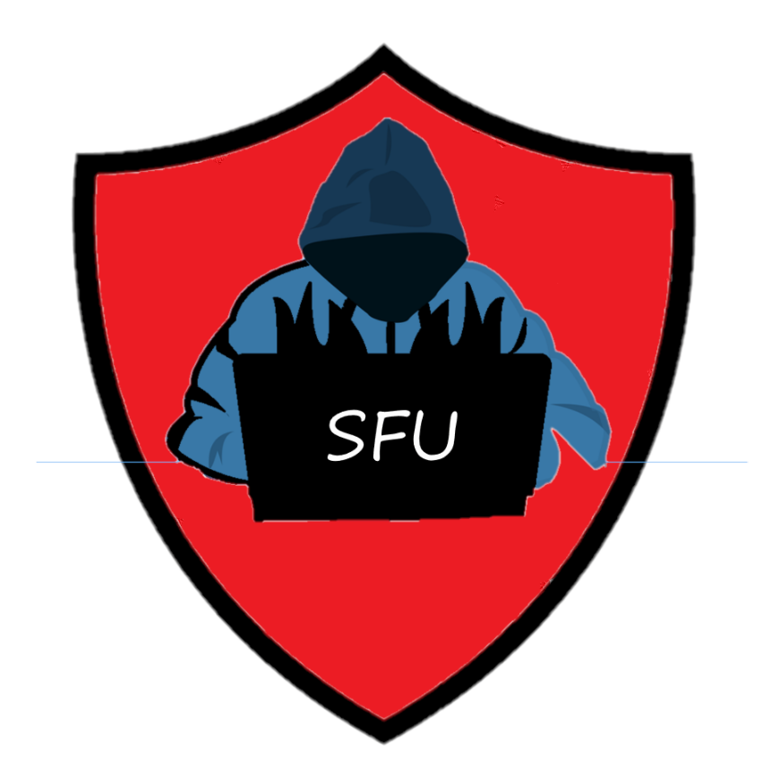

    

Hi, welcome to the SFU Cybersecurity Community (SFUC2)!

SFUC2 is an educational group focused on theoretical and practical aspects of cybersecurity initiated by students in Professional Computer Science program. The group will help raise awareness on Cybersecurity and also share knowledge in weekly meetups in addition to hands-on activities.

We are open to everyone with interest in Computer Security and want to work on their ethical hacking skills. Basic programming/scripting knowledge and familiarity with Linux will really help but isn't mandatory!

Please join the discord server for any announcements/updates! We look forward to meeting as many of you as possible in our meetings!

- Time: 4 PM, on Mondays starting October 25th
- Location : TASC 9204
- [Zoom](https://sfu.zoom.us/j/62331643610?pwd=YVIyb0VKbFhhcjRIem5KSXBQb2lTZz09) :  (for people who aren't able to make it to the in person sessions)
- [Discord](https://discord.gg/9SnYAHbpUh)
